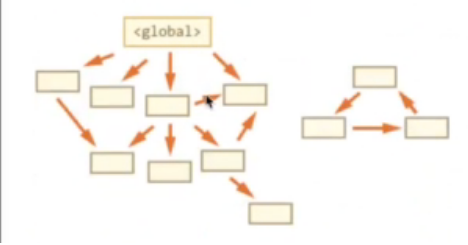

## 栈数据结构
    栈的结构就是后进先出
## 堆数据结构
    堆数据结构是一种树状结构。它的存取数据的方式与书架和书非常相似，我们只需要知道书的名字就可以直接取出书了，
    并不需要把上面的书取出来。JSON格式的数据中，我们存储的key-value可以是无无序的，因为顺序的不同并不影响我们的使用，
    我们只需要关心书的名字。
## 队列
    队列是一种先进先出(FIFO)的数据结构，这是事件循环（Event Loop）的基础结构
## 变量的存放
    首先我们应该知道内存中有栈和堆那么变量应该存放在哪里呢？
    1、基本数据类型 --> 保存在栈内存中，因为这些类型在内存中分别占有固定大小的空间，通过按值来访问。number string Boolean null undefined
    2、引用类型 --> 保存在堆内存中，因为这种的值的大小不固定，因此不能把他们保存到栈内存中。在栈内存中存放的只是该对象的访问地址。当查询引用类型的变量时，
    先从栈中读取内存地址，然后在通过地址找到堆中的值。对于这种，我们把它叫做引用访问。object
    
    栈比堆的运算速度快，object是一个复杂的结构且可以扩展：数组可扩充，对象可添加属性，
    都可以增删改查，将他们放在堆中是为了不影响栈的效率。而是通过引用的方式查找到堆中的实际对象再进行操作。所以查找引用类型值的时候先去查找栈查找再去堆查找。
```
  conat obj = { name: '张三'}
  //先在栈中查找obj,再去堆中查找{name:'张三'}
```
