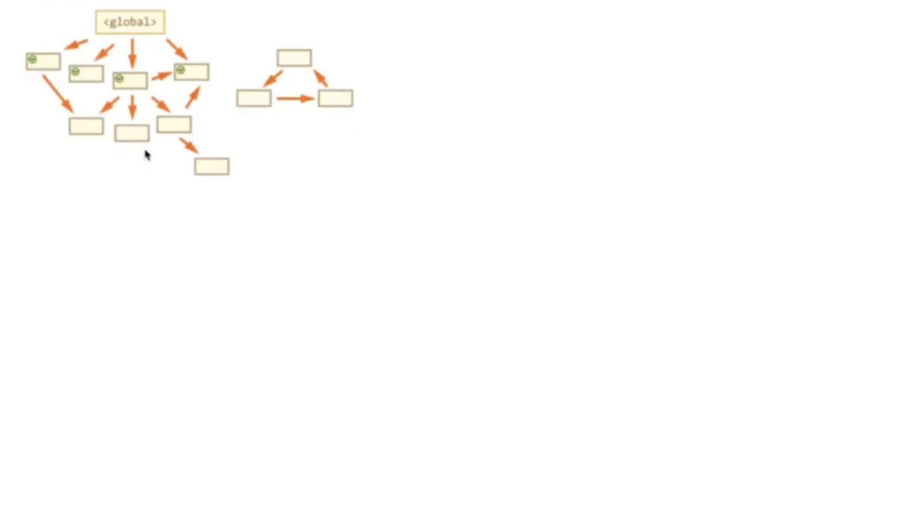
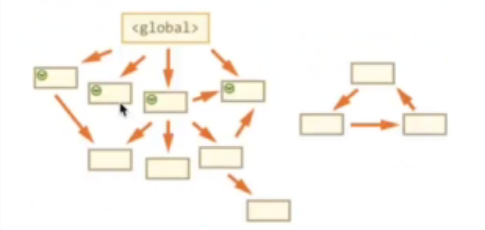
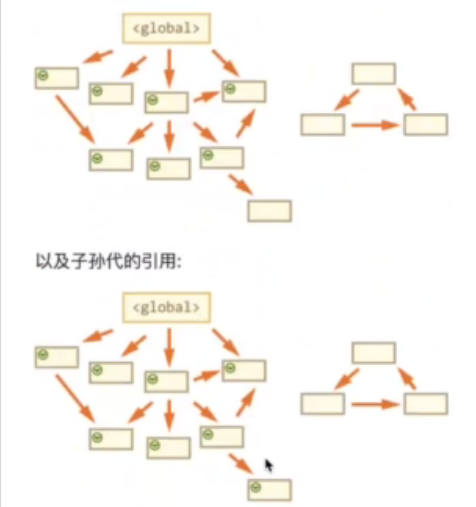
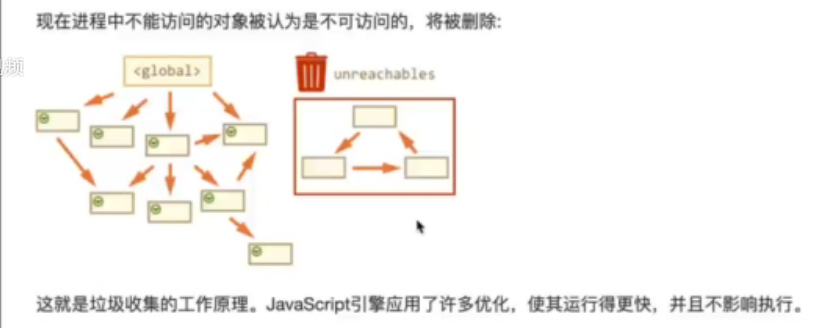
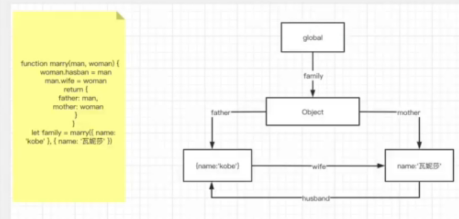
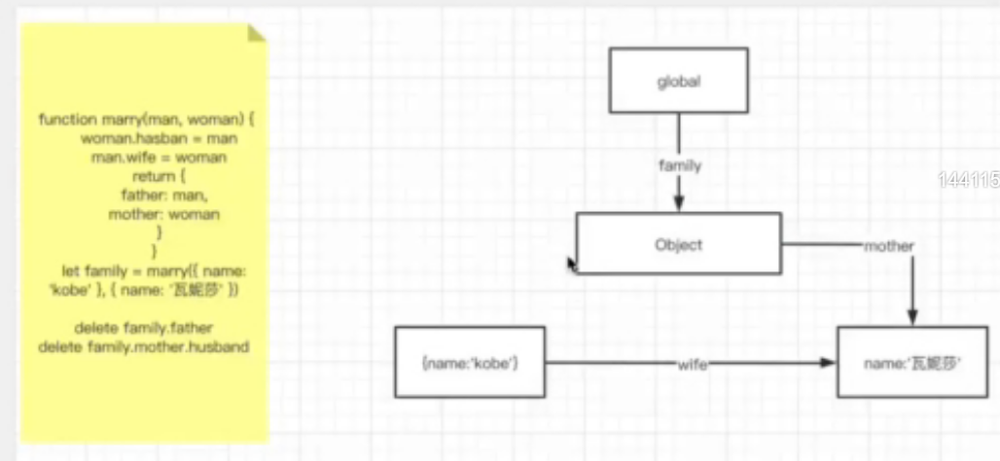
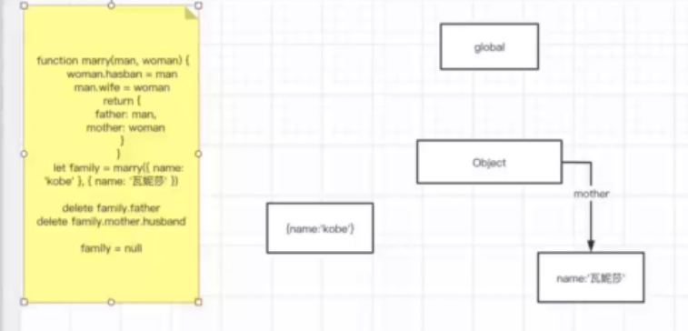
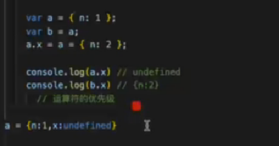
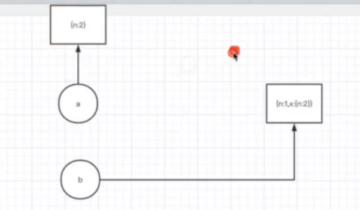

## 内存回放
    JavaScript有自动垃圾收集机制，垃圾收集器会每隔一段时间就执行一次释放操作，找出那些不再继续使用的值，然后释放其占用的内存
    局部变量和全局变量的销毁：
    -- 局部变量：局部作用域中，当函数执行完毕，局部变量也就没有存在的必要了，因此垃圾回收器很容易做出判断并回收。
    -- 全局变量：全局变量什么时候需要自动释放内存空间则很难判断，所以在开发中尽量避免使用全局变量。
## 垃圾回收算法
    对垃圾回收算法来说，核心思想就是如何判断内存已经不再使用，常用垃圾回收算法有下面的两种。
    引用计数（现代浏览器不再使用）
    标记清除（常用）
### 引用计数
     引用计数算法定义“内存不再使用”的标准很简单，就是看一个对象是否有指向它的引用，如果没有其它对象指向它了，说明该对象已经不再需要了。
```js
    var person = {
        age:20,
        name:'Tom'
    }
    person.name = null
    //persong不会被回收，person中name置为null,但是age还存在

    var p = person
    person = 1
    //原来的person不会被回收，p的指针也指向person对象
    p = null 
    //原来的person对象已经没有被引用，被回收
```
     引用计数有一个致命的问题，那就是循环引用。
     如果两个对象相互引用，尽管他们已不再使用，但是垃圾回收器不会进行回收，最终可能会导致内存泄露。
 ```js
    function cycle() {
        var o1 = {}
        var o2 = {}
        o1.a = o2
        o2.a = o1
        return 'cycle'
    }
    cycle()
    //o1、o2会循环引用
```

 ### 标记清除
     标记清除算法将“不再使用的对象”定义为“无法到达的对象”。即从根部（在JS中就是全局对象）出发定时扫描内存中的对象，凡是能从根部到达的对象，保留。那些从 根部出发无法触及到的对象被标记围殴不再使用，稍后进行回收。
     扫描到的保留，扫描不到的销毁
     
     -垃圾回收器获取根并‘标记’（记住）它们
     -然后它访问并‘标记’所有来自它们的引用
     -然后它访问标记的对象并标记它们的引用，所以被访问的对象都被记住
     -以此类推，直到有未访问的引用（可以从根访问）为止。
     -除标记的对象外，所有对象都被删除
     
     例如,对象结构如下：
    
   
    我们可以清除的看到右边有一个”不可到达的块“，现在让我们看看**“标记并清除”**垃圾回收器如何处理它们。
 **第一步标记根**
  
 **然后标记它们的引用**
  
  
 **举例子讲解**
   
   
      此时在var admin = user下添加 user = null，则user的那条线被干掉，而此时user对象内存没有被释放，因为admin还在
   
   
   
     下图：删除father和family.husband，都没被回收
   
   
   
      下图：family = null，从根上断开连接，都被回收
      
   
   
## 测试题
   
   
   
     考察的是.1、运算符的优先级比赋值的= 优先级高  2、连续赋值时，a.x指向的是原来的a
   
   